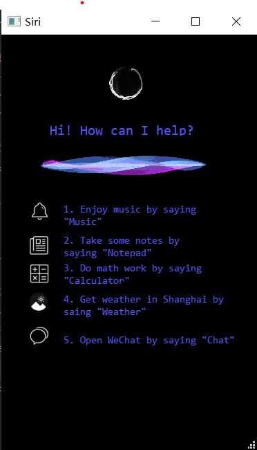
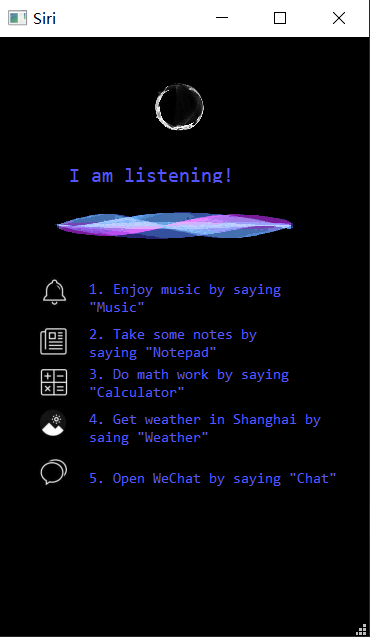

## Lab1: Automatic Speech Recognition

###### Speech Recognition Assistant

> Name: Yangwanting Wu
>
> Student ID: 1852824
>

### 目录

- [Modifications](#Modifications)  
  - [GUI](#GUI)
  - [Code](#Code)
    - [Window](#Window)
    - [Recognize Speech](#Recognize)
    - [Fuzzy keyword matching](#Fuzzy)
    - [Listen for mouse-click events](#Listen) 
    - [System Instructions](#System)
- [Accuracy of Speech Recognition](#Accuracy)
  - Ambient Noise
  - English Pronunciation
- [Improve](#Improve)
  - Improve audio files
  - Invoke other speech recognition interfaces
  - Fuzzy keyword matching


### modifications
<a name="Modifications"></a>  

After a week's structural analysis of asr.py/ asrinterface. py, I changed all the user interfaces in this project


And use Qt Designer to layout the interface

 

### GUI
<a name="GUI"></a>

- **"Hi! How can I help?:** Prompts the user to wake up the way to use the voice assistant
- **Click to wake up:** Prompts the user to wake up the language assistant  *(It is not explicitly stated that clicking Wake up Language Assistant is for the simplicity and atmosphere of the overall interface)*




Displays five help messages:

- **Enjoy music by saying:** Music
- **Take some notes by saying:** Note
- **Do math work by saying:** Calculator
- **Get weather in Shanghai by saing:** Weather
- **Open WeChat by saing:** Chat




### Code
<a name="Code"></a>  


#### 1. Window
<a name="Window"></a>  
- QLabel

  ```python
        self.label.setText(_translate("MainWindow", "1"))
        self.label_2.setText(_translate("MainWindow", "Hi! How can I help?"))
        self.label_3.setText(_translate("MainWindow", "1"))
        self.label_4.setText(_translate("MainWindow", "1. Enjoy music by saying \"Music\""))
        self.label_5.setText(_translate("MainWindow", "2. Take some notes by saying \"Notepad\""))
        self.label_6.setText(_translate("MainWindow", "3. Do math work by saying \"Calculator\""))
        self.label_7.setText(_translate("MainWindow", "4. Get weather in Shanghai by saing \"Weather\""))
        self.label_8.setText(_translate("MainWindow", "5. Open WeChat by saying \"Chat\""))
  ```

  

- QMovie

  ```python
        self.voiceFig = QtWidgets.QLabel(self.centralwidget)
        self.voiceFig.setGeometry(QtCore.QRect(100, 10, 161, 120))
        self.voiceFig.setText("")
        self.gif = QMovie("resource\\file\\voice3.gif")
        self.voiceFig.setMovie(self.gif)
        self.gif.start()
        self.voiceFig.setScaledContents(True)
        self.voiceFig.setObjectName("voiceFig")

        self.siriGif = QtWidgets.QLabel(self.centralwidget)
        self.siriGif.setGeometry(QtCore.QRect(-250, 150, 850, 77))
        self.siriGif.setText("")
        self.gif = QMovie("resource\\file\\voice2.gif")
        self.siriGif.setMovie(self.gif)
        self.gif.start()
        self.siriGif.setScaledContents(True)
        self.siriGif.setObjectName("voiceFig")
  ```


  

#### 2. Recognize Speech
<a name="Recognize"></a>  

The user's voice commands are detected with the microphone and automatically stopped when the sound cannot be detected, and speech recognition is recognized with the recognize_Sphinx

```python
    def recognize_speech_from_mic(self):
        if not isinstance(recognizer, sr.Recognizer):
            raise TypeError("`recognizer` must be `Recognizer` instance")

        if not isinstance(microphone, sr.Microphone):
            raise TypeError("`microphone` must be `Microphone` instance")

        # 根据环境噪音调整识别器的灵敏度并记录音频
        with microphone as source:
            recognizer.adjust_for_ambient_noise(source)
            audio = recognizer.listen(source)

        # set up the response object
        response = {
            "success": True,
            "error": None,
            "transcription": None
        }

        # 试着识别录音中的声音
        # 如果RequestError或UnknownValueError异常被捕获，
        # 相应地更新响应对象
        try:
            response["transcription"] = recognizer.recognize_sphinx(audio)
        except sr.RequestError:
            # API was unreachable or unresponsive# API不可达或无响应
            response["success"] = False
            response["error"] = "API unavailable"
        except sr.UnknownValueError:
            # speech was unintelligible
            response["error"] = "Unable to recognize speech"

        return response
```


#### 3. Fuzzy keyword matching
<a name="Fuzzy"></a>  

recognize_sphinx() API is not good for identify,so I use fuzzy keyword matching to improve accuracy 


```python
                if "music" in command:
                    self.playMusic()
                elif "note" in command\
                        or "no" in command\
                        or "net" in command:
                    self.openNotebook()
                elif "calculator" in command\
                        or "counted" in command\
                        or "eggs" in command:
                    self.openCalculator()
                elif "weather" in command \
                        or "whether" in command\
                        or "when that" in command:
                    self.openWeatherWeb()
                elif "chat" in command\
                        or "check" in command:
                    self.openWeChat()
                else:
                    self.noCatch()
```


#### 4. Listen for mouse-click events
<a name="Listen"></a>  

- From the home page, users can click to activate Siri
- When you wake up Siri, clicking does not activate Siri again

```python
    def mousePressEvent(self, event):
        if(self.flag==True):
            return

        self.flag = True
        global timer
        timer = threading.Thread(target=self.waitForInput)
        timer.start()
```


#### 5. System Instructions
<a name="Instructions"></a>  

```python
    def openWeatherWeb(self):
        webbrowser.open("http://sh.weather.com.cn/")
        self.ui.openWeatherWeb()

    def openCalculator(self):
        os.system("calc.exe")
        self.ui.openCalculator()

    def openNotebook(self):
        os.system("notebook.txt")
        self.ui.openNotebookUi()

    def playMusic(self):
        os.system("resource\\file\\music.wav")
        self.ui.playMusicUi()

    def openWeChat(self):
        os.startfile("C:\Program Files (x86)\Tencent\WeChat\WeChat.exe")
        self.ui.openWeChat()

    def noCatch(self):
        # application.ui.notCatchUi()
        time.sleep(3)
        self.ui.notCatchUi()
```


### Accuracy of SpeechRecognition
<a name="Accuracy"></a>  

The recognize_sphinx() interface is very poor at speech recognition
 

- **The influence of ambient noise:** At first, I thought it was due to ambient noise   

  `r.adjust_for_ambient_noise(source)`

  The effect of reducing the noise by code on the recognition result is still not significant


- **The influence of incorrect English pronunciation:** After the noise effect was reduced, it still did not have any effect, so I thought it should be the English pronunciation problem  

  So I use online dictionary to pronounce,the effect is still poor.

### Improve
<a name="Improve"></a>  

- **Improve audio files:**

  `r.adjust_for_ambient_noise(source)`By default, duration=1.0, the first 1s of audio will be treated as noise, so add approximately 1s of blank space at the beginning of the sound file       

  The effect is average but there is a small increase

- **Fuzzy keyword matching:**

  - Add the error recognition result to the decision statement of the program according to the result of the program's common error recognition
  if the word is recognized as "not", the program will treat it as "note" to open the notepad.

  - Switch to another speech recognition module (not tried yet)
  
- **Invoke other speech recognition interfaces:**

  `r.recognize_google(audio)`Use Google's speech recognition interface for speech recognition

  The processing effect is good, but the processing time is long and the network should be maintained

  Other API `r.recognize_bing()` `r.recognize_ibm()`need key so i haven't done the test.

  